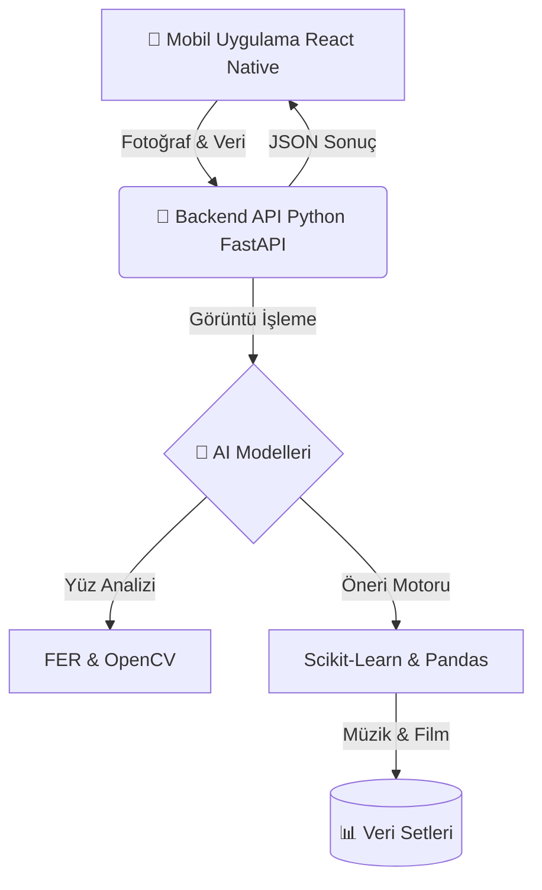

# 🧠 MindMingle AI - Duygu Analizli Öneri Sistemi

> **"Ruh halinizi anlayan, size en uygun film ve müziği sunan yapay zeka asistanınız."**

MindMingle, kullanıcının duygusal durumunu analiz ederek (hem manuel giriş hem de **Yüz Tanıma Teknolojisi** ile) kişiselleştirilmiş içerik önerileri sunan tam kapsamlı bir mobil uygulamadır.

---

## 🏗️ Proje Mimarisi

Bu proje, modern bir **Full-Stack** mimari üzerine kurulmuştur:



## 🌟 Özellikler

-   **📸 Yüz Tanıma ile Duygu Analizi:**
    Kullanıcı selfie çektiğinde, yapay zeka yüz ifadelerini (Mutlu, Üzgün, Kızgın, Nötr) analiz eder ve duygu durumunu otomatik belirler.
-   **🎵 Akıllı Müzik Önerisi:**
    Spotify veri setinden, kullanıcının ruh haline (Valence/Energy değerlerine göre) en uygun şarkıları seçer.
-   **🎬 Film Tavsiyeleri:**
    Netflix arşivinden ruh haline uygun kategorilerdeki (Drama, Komedi vb.) filmleri önerir.
-   **📱 Modern Mobil Arayüz:**
    React Native ile geliştirilmiş, kullanıcı dostu ve şık tasarım.

---

## 🚀 Kurulum ve Çalıştırma

Projeyi kendi bilgisayarınızda çalıştırmak için aşağıdaki adımları izleyin.

### 1. Backend (Sunucu) Kurulumu

Python sunucusu, yapay zeka işlemlerini yapan beynimizdir.

```bash
cd MindMingleApp/backend
pip install -r requirements.txt
uvicorn main:app --host 0.0.0.0 --port 8000
```

### 2. Mobil Uygulama Kurulumu

Mobil arayüzü çalıştırmak için:

```bash
cd MindMingleApp/mobile
npm install
npx expo start
```
*(Telefonunuzdaki Expo Go uygulaması ile QR kodu okutun.)*

---

## 📦 APK Oluşturma

Bu projeden gerçek bir Android uygulaması (.apk) üretmek için detaylı rehberimizi okuyun:
👉 **[APK ve iOS Çıktısı Nasıl Alınır?](APK_VE_IOS_CIKTISI_NASIL_ALINIR.md)**

---

## 🛠️ Kullanılan Teknolojiler

| Alan | Teknoloji |
|---|---|
| **Mobil** | React Native, Expo, Axios |
| **Backend** | Python, FastAPI, Uvicorn |
| **Yapay Zeka** | FER (Facial Expression Recognition), OpenCV, Scikit-Learn |
| **Veri** | Pandas, NumPy |

---

## 👨‍💻 Geliştirici

Bu proje **[Adınız Soyadınız]** tarafından geliştirilmiştir.
